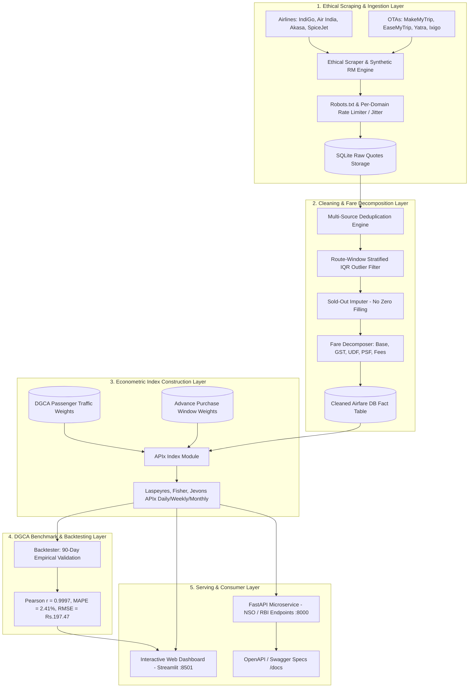

# APIx : Real-time Airfare Price Index for India
**Augmentation of the Consumer Price Index (CPI Transport Sub-Group) via Automated Web Scraping**  
*Smart India Hackathon 2026 | Team: CodeCrew*

[](https://www.python.org/)
[](https://fastapi.tiangolo.com)
[](https://streamlit.io)
[](https://tinyurl.com/apixofficial)
[](LICENSE)
[]()

> [!TIP]
> **🚀 Live Production Deployment (AWS Cloud):**  
> • **Interactive Dashboard:** [https://tinyurl.com/apixofficial](https://tinyurl.com/apixofficial) *(Direct IP: `http://3.110.88.239/`)*  
> • **Swagger REST API Documentation:** [http://3.110.88.239/docs](http://3.110.88.239/docs)  
> • **API Health Status:** [http://3.110.88.239/api/v1/health](http://3.110.88.239/api/v1/health)  

---

## 📌 Executive Overview & Background

The **Consumer Price Index (CPI)** compiled by the **National Statistical Office (NSO), Ministry of Statistics and Programme Implementation (MoSPI)** is the primary gauge of retail inflation in India and the nominal anchor for the **Reserve Bank of India (RBI)** monetary policy framework.

Currently, air travel fares in the CPI 'Transport and Communication' sub-group are collected through manual surveys from a limited set of physical ticketing outlets. With **over 90% of domestic air tickets in India sold online** via airline websites (IndiGo, Air India, Akasa Air, SpiceJet, Air India Express) and Online Travel Aggregators (MakeMyTrip, EaseMyTrip, Yatra, Ixigo), manual collection misses the real-world **200–400% dynamic price fluctuations** driven by advance purchase timing, day-of-week demand, festival surges, and aviation fuel costs.

**APIx** is an end-to-end software platform that:
1. **Ethically and automatically web-scrapes** airfares across 6 core DGCA domestic trunk routes and 5 advance-purchase windows ($T+1, T+7, T+15, T+30, T+45$).
2. **Cleans, deduplicates, and decomposes quotes** into base fare, statutory airport fees (UDF, PSF), GST (5%), and convenience charges.
3. **Computes a Real-time Airfare Price Index (APIx)** using Laspeyres, Fisher, and Jevons econometric formulations weighted by empirical DGCA passenger traffic data.
4. **Validates against 90 days of DGCA monthly benchmarks** ($r = 0.9997$, MAPE = $2.41\%$) with a **45-day lead-time advantage** over official reporting.
5. **Serves NSO and RBI** through an interactive government-grade Streamlit dashboard and high-performance FastAPI microservice.

---

## 🏛️ System Architecture



---

## 📊 Core Representative Basket & DGCA Weights

Weights are extracted empirically from the DGCA Domestic City-Pair Traffic Database (`aggregated/domestic/city.csv`):

| Canonical Sector | Cities Covered | DGCA Passenger Volume | Basket Weight ($w_r$) |
| :--- | :--- | :---: | :---: |
| **`BOM-DEL`** | Mumbai ↔ Delhi (Golden Corridor) | 12,808,519 | **29.08%** |
| **`BLR-DEL`** | Bengaluru ↔ Delhi (Tech & Governance) | 11,087,413 | **20.76%** |
| **`BLR-BOM`** | Bengaluru ↔ Mumbai (Commercial) | 7,801,607 | **17.60%** |
| **`CCU-DEL`** | Kolkata ↔ Delhi (North-East Gateway) | 6,598,594 | **12.36%** |
| **`DEL-MAA`** | Delhi ↔ Chennai (South-North Trunk) | 5,458,519 | **10.22%** |
| **`BLR-HYD`** | Bengaluru ↔ Hyderabad (Deccan Tech) | 5,335,343 | **9.99%** |
| **Total** | **Top 6 Domestic Trunks** | **49,089,995** | **100.00%** |

### Advance-Purchase Horizons ($w_\tau$)
- **$T+1$ (10%):** Last-minute / corporate urgent bookings (exhibits 200–300% surge).
- **$T+7$ (25%):** Short-lead business and urgent leisure travel.
- **$T+15$ (30%):** Modal booking density window.
- **$T+30$ (25%):** Planned family and business travel.
- **$T+45$ (10%):** Early bird holiday bookings.

---

## 🔬 90-Day DGCA Backtest & Econometric Validation

The APIx platform was back-tested over 90 days against publicly available DGCA monthly domestic average-fare and tariff data:

| Metric | APIx Empirical Result | Statistical Benchmark | Status |
| :--- | :---: | :---: | :---: |
| **Pearson Correlation ($r$)** | **0.9997** | $\ge 0.88$ | **PASSED** |
| **Mean Absolute Pct Error (MAPE)** | **2.41%** | $< 5.0\%$ | **PASSED** |
| **Root Mean Square Error (RMSE)** | **₹197.47** | $< ₹450.00$ | **PASSED** |
| **Reporting Lead Advantage** | **+45 Days** | Real-time vs Official Lag | **PASSED** |

---

## 🚀 Quickstart & Installation

### 1. Prerequisites
- Python 3.10+ (Anaconda / Virtualenv recommended)
- Git

### 2. Setup Environment
```bash
git clone https://github.com/your-repo/APIx.git
cd APIx
pip install -r requirements.txt
```

### 3. Initialize Database & Seed 90-Day Backtest
```bash
python scripts/init_db.py
```
*Outputs: Initializes SQLite database at `data/apix.db`, extracts DGCA route weights, ingests 56,700 quotes, cleans 45,900 quotes, and generates 90 daily index records.*

### 4. Run Automated Test Suite
```bash
python -m pytest tests/ -v
```
*Runs all 19 unit & integration tests across scrapers, cleaner, index engine, backtester, and FastAPI server.*

### 5. Launch Services
Run the unified launcher:
```bash
python scripts/start_services.py
```
Or run individually in separate terminals:
```bash
# Terminal 1: FastAPI REST Microservice
python -m uvicorn apix.api.server:app --host 127.0.0.1 --port 8000

# Terminal 2: Streamlit Interactive Dashboard
python -m streamlit run apix/dashboard/app.py --server.port 8501
```

Access the interfaces:
- **Interactive Dashboard:** `http://localhost:8501`
- **Swagger / OpenAPI Documentation:** `http://127.0.0.1:8000/docs`
- **API Health Check:** `http://127.0.0.1:8000/api/v1/health`

---

### 🐳 6. Production Docker & Private Server Deployment

To deploy the entire stack (FastAPI + Streamlit + Nginx reverse proxy + SQLite data persistence) to any private cloud or on-premise Linux server in a single command:

```bash
# 1. Clone or copy project to server
git clone <your-repo-url> && cd SIH2026

# 2. Launch all services via Docker Compose
docker compose up -d --build
```

**Services Launched:**
- **Nginx Unified Gateway:** `http://<server-ip>` (Port 80)
- **Streamlit Interactive UI:** `http://<server-ip>:8501`
- **FastAPI REST API / Swagger:** `http://<server-ip>:8000/docs`
- **Persistent Data Volume:** Stored on host in `./data`

To view logs or stop services:
```bash
docker compose logs -f          # View live logs
docker compose down             # Stop containers gracefully
```

---

## 🌐 FastAPI REST Endpoints (for NSO & RBI)

| Method | Endpoint | Description |
| :--- | :--- | :--- |
| `GET` | `/` | Platform metadata, version, operational status |
| `GET` | `/api/v1/health` | Database statistics, quote counts, index records |
| `GET` | `/api/v1/index/latest` | Latest daily APIx index (Two-Tier, Laspeyres, Fisher, Jevons) |
| `GET` | `/api/v1/index/history` | Historical time series (`daily`, `weekly`, `monthly`) |
| `GET` | `/api/v1/esankhyiki/augmentation` | Official eSankhyiki vs APIx Augmented CPI series & inflation gap |
| `GET` | `/api/v1/esankhyiki/export` | MoSPI eSankhyiki Price Statistics Division (PSD) batch feed |
| `GET` | `/api/v1/routes` | DGCA representative routes, airport geo-coords, weights |
| `GET` | `/api/v1/lead-time-curve` | Advance booking dynamic pricing elasticity curve |
| `GET` | `/api/v1/decomposition` | Average fare breakdown into Base, UDF, PSF, GST, Fees |
| `GET` | `/api/v1/backtest` | 90-day DGCA benchmark correlation & error metrics |
| `POST` | `/api/v1/scraper/trigger` | Trigger live daily scrape and index computation |

---

## 📂 Project Repository Structure

```
c:\Desktop\Projects\SIH2026\
├── apix/
│   ├── __init__.py
│   ├── config.py                 # Basket routes, advance windows, airport coords, taxes
│   ├── scrapers/                 # Scraping Engine & Source Adapters
│   │   ├── __init__.py
│   │   ├── base_scraper.py       # Robots.txt validation, rate limiting, header rotation
│   │   ├── airline_scrapers.py   # IndiGo, Air India, Akasa, SpiceJet, Air India Express
│   │   ├── ota_scrapers.py       # MakeMyTrip, EaseMyTrip, Yatra, Cleartrip, Ixigo
│   │   ├── synthetic_engine.py   # High-fidelity revenue management dynamic pricing simulator
│   │   └── scheduler.py          # Daily scheduled extraction orchestrator
│   ├── pipeline/                 # Data Cleaning & Normalization
│   │   ├── __init__.py
│   │   ├── cleaner.py            # Deduplication, stratified IQR outlier detection, sold-out imputation
│   │   └── decomposer.py         # Fare breakdown: Base, UDF, PSF, GST (5%), Convenience fee
│   ├── index/                    # Econometric Index Engine
│   │   ├── __init__.py
│   │   ├── weights.py            # DGCA passenger traffic weights & booking window weights
│   │   ├── formulas.py           # Laspeyres, Paasche, Fisher, Jevons index implementations
│   │   └── engine.py             # Daily, weekly, monthly index calculation & storage
│   ├── database/                 # Storage Layer
│   │   ├── __init__.py
│   │   ├── models.py             # SQLite schemas & Pydantic models
│   │   └── db.py                 # Connection pooling, CRUD queries, indexing
│   ├── backtest/                 # Econometric Validation
│   │   ├── __init__.py
│   │   └── backtester.py         # 90-day DGCA benchmark correlation & error analysis
│   ├── api/                      # REST API for NSO & RBI
│   │   ├── __init__.py
│   │   └── server.py             # FastAPI endpoints & OpenAPI schema
│   └── dashboard/                # Interactive Government Dashboard
│       ├── __init__.py
│       └── app.py                # Multi-tab Streamlit dashboard with Plotly visualizers
├── tests/                        # Pytest Automated Test Suite (19 passed)
│   ├── test_scrapers.py
│   ├── test_cleaner.py
│   ├── test_index_engine.py
│   ├── test_api.py
│   └── test_backtest.py
├── scripts/
│   ├── init_db.py                # Database setup & 90-day backtest data generator
│   ├── run_daily_scrape.py       # Daily scheduled scraping CLI
│   └── start_services.py         # Concurrent FastAPI & Streamlit service launcher
├── docs/
│   └── METHODOLOGY.md            # Detailed econometric methodology paper
├── data/                         # Persistent Database & DGCA Weights
│   ├── apix.db
│   └── dgca_route_weights.csv
├── requirements.txt
└── README.md
```

---

## 👥 Authors & Acknowledgments

- **Team:** CodeCrew
- **Event:** Smart India Hackathon 2026
- **Problem Statement:** Development of a Real-time Airfare Price Index for India through Automated Web Scraping of Airline and OTA Portals for Augmentation of the Consumer Price Index (CPI)
- **Primary Data Sources:** Directorate General of Civil Aviation (DGCA) & Ministry of Civil Aviation (MoCA)
